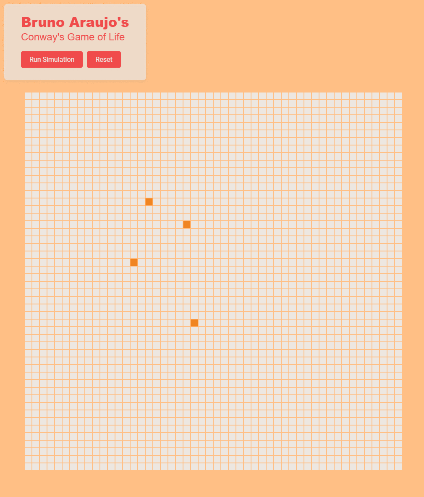

# Bruno Araujo's Conway's Game of Life

Reference: <https://en.wikipedia.org/wiki/Conway%27s_Game_of_Life>

|Project Info||
|-|-|
|Author|[Bruno Araujo](https://github.com/brunurd)|
|Package Manager|[PNPM](pnpm)|
|Bundler|[Vite](./config/vite.config.ts)|
|Language|TypeScript|



---

## How to Run

### Install
Install using preferably [`pnpm`](pnpm) (but npm, yarn or bun can be used too), I recommend to use [Volta](https://docs.volta.sh/guide/getting-started) to manage the executables versions:
```
pnpm i
```

### Start
Run:
```
pnpm start
```
The app will be available in the address: [`http://localhost:13000`]([http://localhost:13000)

[pnpm]: https://pnpm.io/installation

---

## Run tests
After install, you can run:

### For static analysis
```
pnpm lint
```

### For unit tests
```
pnpm unittest
```
Is possible to execute both (lint and unittest) in one command, ideal for CI runners:
```
pnpm test
```
